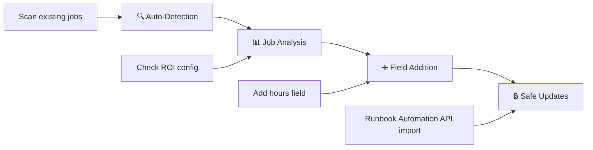

<div align="center">

# 🚀 Runbook Automation ROI Status

[](https://python.org)
[](https://opensource.org/licenses/MIT)
[](https://www.linux.org/)
[](https://docs.rundeck.com/docs/api/)
[](https://github.com/yourusername/runbook-automation-set-roi)
[](https://github.com/psf/black)

*A Python tool to manage ROI (Return on Investment) metrics for Runbook Automation jobs*

[Features](#-features) • [Installation](#-installation) • [Usage](#-usage) • [Documentation](#-documentation) • [Contributing](#-contributing)

</div>

---

## 📋 Overview

**Runbook Automation ROI Status** manages ROI metrics in Runbook Automation job definitions. It detects existing configurations, adds missing ROI fields, and tracks automation value across projects.

### 🎯 Key Capabilities

- **🔍 Auto-Detection**: Detects existing ROI plugin configurations
- **⚡ Bulk Processing**: Processes single projects or all projects
- **🛡️ Dry-Run Mode**: Preview changes before applying
- **📊 Metrics Tracking**: Standardized ROI field management
- **🐧 Linux Support**: Virtual environment integration

---

## ✨ Features

<table>
<tr>
<td width="50%">

### 🔧 Core Functionality
- ✅ Auto-detects existing ROI plugin configurations
- ✅ Adds "hours" field to jobs that don't have it
- ✅ Supports dry-run mode for safe testing
- ✅ Processes single projects or all projects
- ✅ Error handling and logging

</td>
<td width="50%">

### 🚀 Advanced Features
- ✅ Linux-optimized with virtual environment support
- ✅ Configurable default values and API versions
- ✅ Progress reporting and statistics
- ✅ Environment variable credential management
- ✅ Network error handling with timeouts

</td>
</tr>
</table>

---

## 📋 Requirements

| Component | Version | Notes |
|-----------|---------|-------|
| **Python** | 3.7+ | Required for type hints and features |
| **Operating System** | Linux | Linux environment required |
| **Runbook Automation Version** | Commercial Only | Runbook Automation or Runbook Automation Self-Hosted |
| **Runbook Automation Access** | API Token Required | With appropriate permissions |
| **Runbook Automation API** | v46 (configurable) | Supports other versions |

> **⚠️ Important**: This tool only works with commercial versions of Runbook Automation (Runbook Automation or Runbook Automation Self-Hosted) that include the ROI metrics plugin. It will not work with open-source Runbook Automation.
>
> 📚 **Learn more**: [ROI Metrics Documentation](https://docs.rundeck.com/docs/manual/jobs/roi-metrics.html)

---

## 🚀 Installation

### ⚡ Quick Setup (Recommended)

```bash
# Clone the repository
git clone https://github.com/justynroberts/runbook-automation-set-roi.git
cd runbook-automation-set-roi

# Run the automated setup script
./setup_venv.sh
```

> **This script:**
> - Creates a Python virtual environment in `.venv`
> - Installs required dependencies
> - Sets up the package for development

### 🔧 Manual Setup

<details>
<summary>Click to expand manual installation steps</summary>

```bash
# 1. Create virtual environment
python3 -m venv .venv
source .venv/bin/activate

# 2. Install dependencies
pip install -r requirements.txt
pip install -e .
```

</details>

---

## ⚙️ Configuration

### 🔑 API Token Generation

To generate an API token in Runbook Automation:

1. **Log into your Runbook Automation instance**
2. **Navigate to User Profile**:
   - Click your username in the top-right corner
   - Select "Profile" from the dropdown menu
3. **Generate API Token**:
   - Go to the "User API Tokens" tab
   - Click "Generate New Token"
   - Provide a name for the token (e.g., "ROI Manager")
   - Set appropriate expiration date
   - Click "Generate Token"
4. **Copy the token** - it will only be displayed once

### 🔑 Required Environment Variables

```bash
export RUNDECK_URL='https://your-rundeck-server.com'
export RUNDECK_API_TOKEN='your-api-token'
```

### 🎛️ Optional Configuration

You can customize these values in [`main.py`](main.py):

| Setting | Default | Description |
|---------|---------|-------------|
| `DEFAULT_HOURS_SAVED` | `0.1667` | Default value for hours saved (10 minutes) |
| `API_VERSION` | `"46"` | Runbook Automation API version |
| Field key | `"hours"` | ROI field identifier |
| Field label | `"Hours Saved By automation"` | Display label |

---

## 🎮 Usage

### 🔄 Activate Virtual Environment

```bash
source .venv/bin/activate
```

### 📖 Command Reference

<table>
<tr>
<th width="40%">Command</th>
<th width="60%">Description</th>
</tr>
<tr>
<td>

```bash
python main.py
```

</td>
<td><strong>Default dry-run</strong> - Shows what would be changed</td>
</tr>
<tr>
<td>

```bash
python main.py --dryrun
```

</td>
<td><strong>Explicit dry-run</strong> - Safe preview mode</td>
</tr>
<tr>
<td>

```bash
python main.py --apply
```

</td>
<td><strong>Apply changes</strong> - Actually makes modifications</td>
</tr>
<tr>
<td>

```bash
python main.py --project myproject --apply
```

</td>
<td><strong>Project-specific</strong> - Target single project</td>
</tr>
</table>

### 🎯 Command Line Options

| Option | Description | Default |
|--------|-------------|---------|
| `--project PROJECT` | Process specific project | All projects |
| `--dryrun` | Preview changes without applying | ✅ Default |
| `--apply` | Apply changes to jobs | ❌ Explicit only |
| `--help` | Show help message | - |

> **⚠️ Safety Note**: The script defaults to dry-run mode. You must explicitly use `--apply` to make actual changes.

### 💡 Usage Examples

<details>
<summary>📋 Common Usage Patterns</summary>

```bash
# 🔍 Preview all changes (safe exploration)
python main.py

# 🎯 Target specific project for testing
python main.py --project development --dryrun

# ✅ Apply changes to production project
python main.py --project production --apply

# 🚀 Full deployment (after testing)
python main.py --apply
```

</details>

---

## 📊 Recent Improvements

### 🎉 Version 2.0 Updates

<div align="center">

| 🐛 **Bug Fixes** | 🚀 **Enhancements** | 🛡️ **Safety** |
|:---:|:---:|:---:|
| Fixed duplicate job counting | Intuitive CLI with `--apply`/`--dryrun` | Default dry-run mode |
| Resolved NoneType errors | Better output formatting | Mutually exclusive options |
| Enhanced null checking | Clear progress indicators | Input validation |

</div>

### 📈 Output Examples

```bash
✅ [project] job_name - Already has hours (0.25)
🆕 [project] job_name - add hours [0.1667]
❌ [project] job_name - Failed to retrieve definition

Summary:
Projects: 3 | Jobs: 25 | Updates: 8
⚠️  Dry run complete - use --apply to apply changes
```

---

## 🔧 How It Works

<div align="center">



</div>

1. **🔍 Auto-Detection**: Scans existing jobs to detect ROI plugin name
2. **📊 Job Analysis**: Checks each job for existing ROI metrics configuration
3. **➕ Field Addition**: Adds "hours" field to jobs that don't have it
4. **🔒 Safe Updates**: Uses Runbook Automation's job import API with update mode

### 📋 ROI Metrics Structure

The tool adds ROI metrics in the standard format defined by Runbook Automation. For more details, see the [ROI Metrics Documentation](https://docs.rundeck.com/docs/manual/jobs/roi-metrics.html).

```json
{
  "plugins": {
    "ExecutionLifecycle": {
      "roi-metrics-data": {
        "userRoiData": "[{\"key\":\"hours\",\"label\":\"Hours Saved By automation\",\"desc\":\"Number of hours saved by this automation\",\"value\":\"0.1667\"}]"
      }
    }
  }
}
```

---

## 🛡️ Security & Error Handling

### 🔐 Security Features

- ✅ API tokens from environment variables
- ✅ No credentials in code
- ✅ HTTPS support
- ✅ Request timeouts

### 🚨 Error Handling

<table>
<tr>
<td width="50%">

**Network & API Errors**
- Network timeouts and connection errors
- Invalid API responses
- Authentication failures

</td>
<td width="50%">

**Data & Configuration Errors**
- Missing or malformed job definitions
- Plugin detection issues
- Invalid ExecutionLifecycle structures

</td>
</tr>
</table>

---

## 🔧 Troubleshooting

<details>
<summary>🚨 Common Issues & Solutions</summary>

### 1. **"Connection error"**
```bash
# Solution: Verify RUNDECK_URL and network connectivity
export RUNDECK_URL='https://your-rundeck-server.com'
```

### 2. **"HTTP error 401"**
```bash
# Solution: Verify API token validity and permissions
export RUNDECK_API_TOKEN='your-valid-token'
```

### 3. **"No projects found"**
```bash
# Solution: Check API token project access permissions
```

</details>

---

## 🏗️ Development

### 📁 Project Structure

```
📦 runbook-automation-set-roi/
├── 🐍 main.py              # Main application code
├── 📋 requirements.txt     # Python dependencies
├── ⚙️ setup.py            # Package setup configuration
├── 🚀 setup_venv.sh       # Virtual environment setup script
└── 📖 README.md           # This documentation
```

### 🧪 Testing and Validation

<div align="center">

| Step | Command | Purpose |
|:----:|:--------|:--------|
| **1** | `python main.py --project test-project --dryrun` | 🔍 Test with dry-run |
| **2** | `python main.py --project single-project --apply` | ✅ Validate single project |
| **3** | `python main.py --apply` | 🚀 Full deployment |

</div>

### 🤝 Contributing

1. 🍴 Fork the repository
2. 🌿 Create a feature branch
3. 🔧 Make changes in the virtual environment
4. 🧪 Test thoroughly with `--dryrun` mode first
5. ✅ Validate with `--apply` on test projects
6. 📤 Submit a pull request

### 📏 Best Practices

<table>
<tr>
<td>

**🛡️ Safety First**
- Always run dry-run first
- Test on single projects
- Monitor output for errors

</td>
<td>

**📊 Deployment Strategy**
- Backup job definitions
- Incremental deployment
- Monitor for issues

</td>
</tr>
</table>

---

## 📝 Changelog

<details>
<summary>📋 Version History</summary>

### 🎉 v2.0.1 (Latest)
- **🐛 CRITICAL FIX**: Resolved NoneType errors in job processing
- **🔧 Enhanced**: Better null checking for job definitions
- **📊 Improved**: More robust error handling for malformed data
- **✅ Fixed**: ExecutionLifecycle validation issues
- **🧹 Added**: Automatic cleanup of None values
- **📝 Improved**: Better error messages for debugging

### 🚀 v2.0.0
- **💥 BREAKING**: Changed CLI from `--no-dry-run` to `--dryrun`/`--apply`
- **🐛 Fixed**: Job counting accuracy in dry-run mode
- **✨ Enhanced**: Output formatting with "add hours [value]" format
- **🛡️ Improved**: Default dry-run mode for safety
- **⚙️ Added**: Mutually exclusive command line options

### 🎯 v1.0.0 (Initial Release)
- Auto-detection of ROI plugin names
- Bulk processing of Runbook Automation jobs
- ROI metrics field addition
- Project filtering support
- Error handling
- Linux virtual environment support

</details>

---

## 📄 License

<div align="center">

This project is licensed under the **MIT License**.

[](https://opensource.org/licenses/MIT)

</div>

---

## 🆘 Support

<div align="center">

**Need Help?** Follow these steps:

1. 📖 Check the [troubleshooting section](#-troubleshooting)
2. 📚 Review [Runbook Automation API documentation](https://docs.rundeck.com/docs/api/)
3. 📚 Review [ROI Metrics documentation](https://docs.rundeck.com/docs/manual/jobs/roi-metrics.html)
4. ⚙️ Verify your environment configuration
5. 🧪 Test with dry-run mode first

</div>

### ⚠️ Support Disclaimer

This tool is provided **as-is** and is **not part of the general PagerDuty support program**. Support is provided on a best-effort basis through community channels only.

- ✅ Community support via GitHub issues
- ❌ Not covered by PagerDuty commercial support
- ❌ No SLA or guaranteed response times
- ❌ Not officially maintained by PagerDuty

---

<div align="center">

**Built for DevOps Teams**

[](https://python.org)
[](https://www.linux.org/)
[](https://www.rundeck.com/)

</div>